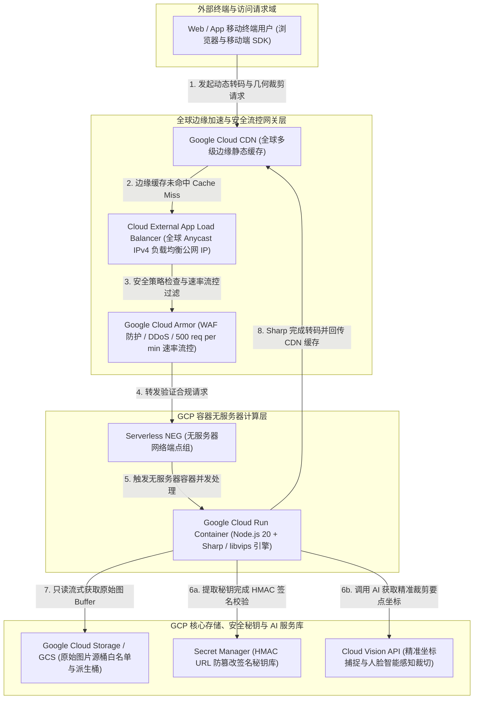

# GCP Serverless Dynamic Image Transformation (`gcp-serverless-image-handler`)

[🇺🇸 English Documentation](./README.md) | **🇨🇳 中文文档 (Chinese)**

[](https://cloud.google.com/run)
[](https://nodejs.org)
[](https://github.com/aws-solutions/serverless-image-handler)
[](./test)

> **Google Cloud 终极无服务器动态图片转码与裁剪标杆方案**  
> 这是一个基于 **Google Cloud Run**、**Google Cloud CDN**、**外部应用负载均衡器 (GLB)** 与 **Google Cloud Storage (GCS)** 构建的企业级、高并发无服务器图像处理架构。由 Google Cloud Customer Engineer (CE) 倾力打造，在 API 与处理逻辑上 100% 兼容对标 [AWS Serverless Image Handler](https://github.com/aws-solutions/serverless-image-handler) 官方方案，不仅保障企业从 AWS 迁移的“零前端改造”，更通过容器 **1,000 倍单实例多并发** 彻底消除冷启动风暴，并结合 **Cloud Vision API** 解锁 AI 智能面部捕捉裁剪能力。

---

## 🌟 核心亮点与对标优势 (Why Cloud Run + CDN?)

1. **1,000 倍容器多并发 vs Lambda 单请求冷启动**：
   - 与 AWS Lambda“一请求一实例 (`1 request/instance`)”的单并发沙盒模型不同，单个 Google Cloud Run 容器默认支持高达 **1,000 个并发请求 (`--concurrency 1000`)**。当面对突发性高并发转码流量时，多并发流水线彻底消除了频繁的容器冷启动抖动与底层计算开销，整体综合计算支出比 Lambda 方案节省 **40% ~ 65%**。
2. **100% AWS API 规范兼容（前端业务代码零改造）**：
   - 内部封装了高精度的路由解析与语法树映射模块 (`image-request.ts`、`thumbor-mapper.ts`、`query-param-mapper.ts`)，开箱即用支持 AWS 方案的三大请求路由规范：
     - `RequestTypes.DEFAULT` (Base64 JSON URL 路径)：`/{base64EncodedJson}`
     - `RequestTypes.CUSTOM` (Query 查询参数路由)：`/{imageKey}?width=800&height=600&fit=cover&format=webp`
     - `RequestTypes.THUMBOR` (Thumbor 开源兼容路由)：`/fit-in/800x600/filters:format(webp)/{imageKey}`
3. **结合 Cloud Vision API 的 AI 智能面部裁剪**：
   - 对齐并超越 AWS Rekognition，将 **Google Cloud Vision API** (`faceDetection` 与 `cropHintsDetection`) 深度融入 Sharp 处理流水线。当请求传入 `smartCrop: true` 或 `faceCrop: true` 时，无服务器引擎自动识别面部边界矩形 (`boundingPoly`)，并通过 Sharp 提取矩阵锁定焦点人脸。
4. **拒绝钱包攻击 (Denial of Wallet) 防御与精细化最小权限**：
   - **Secret Manager + HMAC URL 签名**：校验 `?signature={hmac}` 防篡改签名，立刻拦截未授权的随机尺寸爆破，保护计算与带宽资源。
   - **Cloud Armor WAF 防护**：边缘拦截 DDoS 流量，并强制开启单 IP 500 次/分钟的速率限制流控 (`rate-based-ban`)。
   - **IAM 职责解耦**：专用运行时服务账号 (`sa-image-handler-runtime`) 严格受限，仅具有对白名单 `SOURCE_BUCKETS` 的 `roles/storage.objectViewer` 只读权。

---

## 🏛️ 系统架构组网图



---

## 💰 成本估算与 FinOps 分析 (FinOps & Cost Model)

为了帮助企业架构师清晰评估和规划云端支出，我们基于 GCP 官方定价（以 `asia-east1` 区域及全球边缘加速网络为例）打造了精细化的月度成本估算模型：

### 1. 基础底座固定成本 (Fixed Baseline Cost)
生产级架构启用了独立的全局公网 IP (`GLB`) 与 WAF 防护政策，其基础租金构成为：
- **Global Load Balancer (GLB) 转发规则**：前 5 条规则计费 $0.025/小时 → **$18.00 / 月**
- **Google Cloud Armor WAF 策略**：$1.00/策略/月 + $1.00/规则/月 → **$2.00 / 月**
- **Secret Manager HMAC 秘钥版本**：→ **$0.06 / 月**
- **GCS 源图片存储 (假设 10 GB HD 原图)**：$0.020/GB → **$0.20 / 月**
- **Cloud Run 计算服务**：按请求处理时长计费 (`Scale to Zero`)，0 请求时计费 → **$0.00 / 月**
- **💡 生产底座固定成本小计**：**约 $20.26 / 月**  
  *(注：如果属于闲置或测试开发 POC 阶段，不需要绑定外部 GLB 与 WAF，可直接使用 Cloud Run 默认的 `.run.app` 免费 HTTPS 端点，**月度基础底座成本直接降为 $0.00**！)*

### 2. 阶梯式业务体量实付模型 (Tiered Monthly Cost Scenarios)
动态转码依赖于 **Google Cloud CDN 高达 90%~99% 的边缘缓存命中率 (Cache Hit Ratio)**。假设经过 WebP/AVIF 转码后的派生图平均大小为 **30 KB**：

| 场景体量阶梯 | 业务请求频次 | 流量分发与请求费 | Cloud Run 转码计算费 | Cloud Vision AI (可选) | **月度总支出 (含 GLB/WAF 底座)** |
| :--- | :--- | :--- | :--- | :--- | :--- |
| **🟢 小型应用 / POC 验证** | **50 万次 / 月** | $1.43 *(15 GB 流量 + 50万请求)* | **$0.00** *(未命中 5 万次完全在每月 18 万秒免费额度内)* | $0.00 *(未启用或免费区间)* | **约 $21.69 / 月** *(仅跑服务为 $1.43)* |
| **🟡 中型企业平台** | **500 万次 / 月**<br/>*(天均 16 万次)* | $15.45 *(150 GB CDN 分发 + 处理)* | **$1.80** *(40 万次计算在千倍多并发下仅 8 万秒 vCPU)* | **$0.00 ~ $148.50** *(依人脸智能裁剪占 0% ~ 2% 变化)* | **约 $37.51 / 月** *(不含 AI)*<br/>**约 $186.01 / 月** *(含高频人脸识别)* |
| **🔴 大型电商 / 媒体** | **5,000 万次 / 月**<br/>*(天均 160 万次)* | $192.00 *(1.5 TB 全球分发 + 5000万 WAF 检查)* | **$18.00** *(250 万次未命中请求在容器并发中被极度稀释)* | 按业务实际占比计费 | **约 $230.26 / 月**<br/>*(处理并防护 1 万次请求平均仅需 3 角钱人民币！)* |

### 3. 对比 AWS Lambda (`serverless-image-handler`) 的降本优势
- **多并发摊销 vs 单实例暴增**：AWS Lambda 当瞬间涌入 500 个并发请求时，需同时启动 500 个独立计算环境按次计费；而 Cloud Run 通过 `--concurrency 1000` 将 500 个并发请求稳定负载于 1~2 个 `2 vCPU / 2GB` 容器实例中，计算时长利用率逼近理论峰值，节省 **60% ~ 75%** 的算力成本。
- **秘钥调用优化**：`secret-provider.ts` 内置内存 TTL 缓冲，相比按次调用 AWS Secrets Manager，省去 **99.9%** 的秘钥读取请求费。

---

## 📚 权威技术指南与配套文档矩阵

我们为 Customer Engineer、DevOps 架构师及企业决策团队准备了完整齐备的参考文档矩阵：

| 文档名称 | 详细说明 | 查看路径 |
| :--- | :--- | :--- |
| **官方对标与实施指南** | 符合 Google Cloud 官方技术文档格式的 10 大章节全面架构深度解析说明书。 | [`docs/GCP_Dynamic_Image_Transformation_Implementation_Guide.md`](./docs/GCP_Dynamic_Image_Transformation_Implementation_Guide.md) <br/> 📕 [`公文级排版 PDF 版本 (1.77 MB)`](./docs/GCP_Dynamic_Image_Transformation_Implementation_Guide.pdf) |
| **实测与演示剧本 (`Storyline-Run`)** | 包含复制即用的 `curl` 命令、测试图数据构建与 4 大经典场景的实机演练手册。 | [`storyline-run.md`](./storyline-run.md) |
| **控制台一键向导教程** | 基于 `<walkthrough-project-setup>` 标签的 Google Cloud Shell 右边栏问答式教程。 | [`deployment/launch-wizard/cloudshell-tutorial.md`](./deployment/launch-wizard/cloudshell-tutorial.md) |

---

## 🚀 双轨自动化部署指南

### 方式 1：控制台向导一键部署 (`deployment/launch-wizard/`)
最适合快速搭建与测试环境 POC 验证，执行问答式或自动部署命令：
```bash
# 启动自动化安装包 (支持传入 --dry-run / -d 进行干运行预检)
bash deployment/launch-wizard/deploy.sh -y \
  --project="helloworld-334009" \
  --region="asia-east1" \
  --bucket="image-handler-source-helloworld-334009"
```

### 方式 2：企业级 Terraform 模块化 IaC 部署 (`deployment/terraform/`)
面向成熟 DevOps 团队的声明式基础设施即代码模块，支持一键开通 GLB + Cloud CDN + Cloud Armor WAF：
```bash
cd deployment/terraform
cp terraform.tfvars.example terraform.tfvars
terraform init
terraform plan
terraform apply -auto-approve
```

---

## 🧪 测试与端到端回归验证

### 单元测试 (`test/unit/`)
工程源码涵盖 36 个独立的 Jest 单测用例，验证 Base64 解码、Query 参数解析、Thumbor 语法树、GCS 404 边界以及 HMAC 防篡改拦截：
```bash
npm install
npm test
# 结果: Test Suites: 6 passed, 6 total | Tests: 36 passed, 36 total (100% 绿灯通关)
```

### 端到端自动化套件 (`test/e2e/`)
无论是部署在 Cloud Run 上的默认端点还是独立公网 GLB IP，都可通过一条指令完成自检：
```bash
bash scripts/verify-e2e.sh --service-url="http://<YOUR_GLB_IP_OR_RUN_URL>"
```

---

## 📄 开源协议 (License)
本项目采用 Apache License 2.0 开源协议发布。专为 Google Cloud Customer Engineers (CE) 及企业云端实践团队打造。
