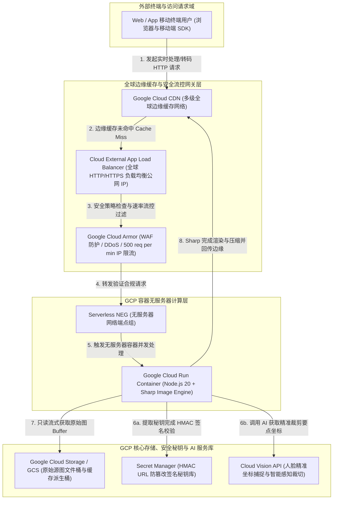

# Dynamic Image Transformation for Google Cloud CDN — 实施与官方对标指南 (Implementation Guide)

> [!IMPORTANT]
> **关于本官方实施指南 (About This Documentation)**  
> 本实施指南（Implementation Guide）严格对标并参考了 **AWS 官方解决方案《Dynamic Image Transformation for Amazon CloudFront》** 的完整章节结构与技术深度，以 **Google Cloud (GCP) 官方技术文档风格** 为 Google Cloud Customer Engineer (CE)、架构师与迁移企业客户打造。  
> 本指南详细阐述了如何在 Google Cloud 上利用 **Google Cloud Run (无服务器容器)**、**Google Cloud CDN (全球多级边缘缓存)**、**Cloud External Application Load Balancer (GLB)** 与 **Google Cloud Storage (GCS)** 构建毫秒级响应、多并发无冷启动、内置 AI 智能裁剪与精细化安全防御的动态图片转码加速体系。

---

## 目录 (Table of Contents)

1. [解决方案概述与核心价值 (Solution Overview)](#1-解决方案概述与核心价值-solution-overview)
2. [系统架构与工作流 (Architecture & Workflow)](#2-系统架构与工作流-architecture--workflow)
3. [AWS 与 GCP 核心能力与对标分析表 (Service Benchmark)](#3-aws-与-gcp-核心能力与对标分析表-service-benchmark)
4. [完全兼容的 API 接口规范 (API Reference & Request Formatting)](#4-完全兼容的-api-接口规范-api-reference--request-formatting)
   - [4.1 标准 Base64 JSON 路由 (RequestTypes.DEFAULT)](#41-标准-base64-json-路由-requesttypesdefault)
   - [4.2 Query 查询参数自定义路由 (RequestTypes.CUSTOM)](#42-query-查询参数自定义路由-requesttypescustom)
   - [4.3 Thumbor 开源兼容语法路由 (RequestTypes.THUMBOR)](#43-thumbor-开源兼容语法路由-requesttypesthumbor)
5. [AI 智能面部裁剪与内容安全联动 (Cloud Vision API Integration)](#5-ai-智能面部裁剪与内容安全联动-cloud-vision-api-integration)
6. [企业级安全防御与 HMAC 签名验签 (Security & HMAC Authentication)](#6-企业级安全防御与-hmac-签名验签-security--hmac-authentication)
7. [成本模型与 FinOps 优化分析 (FinOps & Cost Model)](#7-成本模型与-finops-优化分析-finops--cost-model)
8. [双轨自动化部署指南 (Dual Deployment Guide)](#8-双轨自动化部署指南-dual-deployment-guide)
   - [8.1 方式 A：Launch Wizard 控制台向导模式 (Click-to-Deploy)](#81-方式-a-launch-wizard-控制台向导模式-click-to-deploy)
   - [8.2 方式 B：Terraform 模块化 IaC 部署 (Enterprise IaC)](#82-方式-b-terraform-模块化-iac-部署-enterprise-iac)
9. [日常运维、监控与故障排查 (Operations, Monitoring & Troubleshooting)](#9-日常运维-监控与故障排查-operations-monitoring--troubleshooting)
10. [二次开发与单元测试规范 (Customizing the Solution)](#10-二次开发与单元测试规范-customizing-the-solution)

---

## 1. 解决方案概述与核心价值 (Solution Overview)

现代化的电商平台、新闻媒体与数字营销应用通常需要在数十种不同的前端设备终端（移动端屏幕、高分屏平板、桌面浏览器等）呈现海量的动态视觉素材。如果为每种屏幕预先渲染并存储所有尺寸和编码格式的派生图，将带来沉重的存储成本与冗长的 CI/CD 构建流水线。

**Dynamic Image Transformation for Google Cloud CDN** 解决方案为您解决了这一难题。本方案采用高并发 Node.js + Sharp 图像处理引擎，构建于真正无服务器的容器化架构之上，支持根据客户端发出的实时请求，自动执行图片转码（如 WebP/AVIF）、动态几何比例裁剪、滤镜调色与水印处理。当边缘首次处理完毕后，运算结果将自动写入 **Google Cloud CDN** 的全球边缘缓存网络，后续海量相同规格的请求将直接以毫秒级自边缘就近响应，再也不对源站与后台计算集群构成任何回源开销。

### 核心架构优势：
- **无缝平滑迁移**：后端接口解析器 (`image-request.ts`) 与操作算子映射完全兼容 AWS `serverless-image-handler` 规范，存量前端应用无需一行代码改造即可直接迁移。
- **单容器千级多并发模型**：彻底革新了传统 Serverless（如 Lambda）“一请求一实例”所遭遇的频繁冷启动延迟与内存突发溢出。单个 Cloud Run 实例默认可稳定承载高达 **1,000 个并发连接**，大幅降低由于高并发瞬间流量带来的容器频闪冷启动（Cold Start Bottleneck）。
- **职责解耦与最小权限原则**：区分控制台资源开通账号与运行时服务账号 (`sa-image-handler-runtime`)。运行时容器仅拥有对指定 GCS 源存储桶 (`roles/storage.objectViewer`) 与 Secret Manager (`roles/secretmanager.secretAccessor`) 的最小只读访问权限，彻底杜绝数据越界风险。

---

## 2. 系统架构与工作流 (Architecture & Workflow)

本方案在 Google Cloud 上采用企业级经典的多层无服务器高可用组网架构（见下图）。客户直接通过外部全局负载均衡器（GLB）暴露的统一 IP 或自定义加速域名访问系统：



### 端到端完整处理工作流解析：
1. **客户端请求发起**：用户客户端（Web/iOS/Android）通过全局外部 HTTP(S) 负载均衡器（GLB IP 或绑定域名）向特定 URL 发出动态转换请求。
2. **边缘加速与缓存命中**：请求首先抵达 **Google Cloud CDN** 的就近边缘网络节点。如果该转码规格此前被处理过且在 TTL 有效期内（Cache Hit），CDN 直接从边缘返回压缩完的字节流，响应延迟仅数毫秒。
3. **安全流控过滤**：若出现缓存未命中（Cache Miss），请求经由 GLB 传递并由外层的 **Google Cloud Armor** 进行安全校验（例如执行 `rate-based-ban`，拦截单 IP 超过 500 次/分钟的异常爆破请求）。
4. **Serverless NEG 智能分发**：合规请求进入 `Serverless NEG`（无服务器网络端点组），按负载情况将流量动态智能分发给背后的 **Google Cloud Run** 容器集群。
5. **多协议路由解析与安全验签**：`Cloud Run` 容器内的 Express/Node.js 服务接收 HTTP 请求，`ImageRequest` 分发器智能判定请求属于 Base64、Query 还是 Thumbor 路由模式；如启用了 HMAC 签名，系统自动向 **Secret Manager** 读取最新秘钥完成防篡改校验。
6. **AI 与源图读取**：对于含 `smartCrop` / `faceCrop` 的指令，处理引擎首先异步调用 **Cloud Vision API** 解析人脸边界 Box 坐标；紧接着经由服务账号对 GCS 源图进行流式下载获取内存 Buffer。
7. **Sharp 极速渲染与边缘固化**：底层 `sharp` (C++ libvips) 引擎应用尺寸缩放、色彩调整、EXIF 整理与格式转换（转为 WebP/AVIF）；最终容器返回 HTTP `200 OK`，附带 `Cache-Control: public, max-age=31536000, immutable`，CDN 边缘节点自动固化此结果，完成完整闭环。

---

## 3. AWS 与 GCP 核心能力与对标分析表 (Service Benchmark)

为了协助架构师清晰评估和对齐双方云平台技术栈，下表列出了本方案与 AWS `serverless-image-handler` 在架构组件与能力指标上的精准对标：

| AWS 架构组件与服务 | GCP 核心对标服务与组件 | 架构对标优势与技术规范解析 |
| :--- | :--- | :--- |
| **Amazon CloudFront** | **Google Cloud CDN** | 原生集成于 GCP 负载均衡体系，支持多级全球边缘网络缓存、Stale-While-Revalidate，大幅降低源站回源流量。 |
| **Amazon API Gateway / Lambda@Edge** | **Cloud External Application Load Balancer** | 采用全局单一外部公网 IP (`GLB IP`) 并通过 Serverless NEG 直接挂载 Cloud Run，网络延迟更低且统一 TLS 终结。 |
| **AWS Lambda** (`image-handler`) | **Google Cloud Run** (`image-handler`) | 单容器支持 **1,000 并发连接**，解决 Lambda 单并发产生的冷启动频繁、实例闪烁与请求堆积问题。 |
| **Amazon S3** (`SOURCE_BUCKETS`) | **Google Cloud Storage (GCS)** | 支持逗号分隔的多源存储桶 (`SOURCE_BUCKETS`) 映射，由统一的最小权限 IAM 角色进行数据边界隔离。 |
| **Amazon Rekognition** | **Google Cloud Vision API** | 深度集成于流水线，完美支持坐标级人脸定位 (`faceDetection`) 与内容安全感知提示裁切 (`cropHintsDetection`)。 |
| **AWS Secrets Manager** | **Google Cloud Secret Manager** | 存储并向运行时容器下发 HMAC 签名秘钥 (`SECRET_KEY_NAME`)，防止未经授权的尺寸遍历与爆破。 |
| **AWS WAF** | **Google Cloud Armor** | 为无服务器后端提供企业级边缘 DDoS 防护、SQLi 拦截与精细化 IP 速率流控 (`rate-based-ban`)。 |

---

## 4. 完全兼容的 API 接口规范 (API Reference & Request Formatting)

为了保障业务前端层在云端迁移过程中 **完全零改造**，方案核心代码（`src/image-request.ts` 及各 Mapper 模块）100% 对齐并实现了 AWS 方案的全部三大路由解析协议。

### 4.1 标准 Base64 JSON 路由 (`RequestTypes.DEFAULT`)
将统一的 JSON 负载规范对象经过 URL-Safe Base64 (`+/` 转 `-_`，去除末尾 `=`) 编码，作为 URL URL 路径唯一标识。

**请求 URL 结构**：
```http
GET /{base64EncodedJson} HTTP/1.1
Host: <GLB_IP_OR_DOMAIN>
```

**JSON 参数结构完整参考示例**：
```json
{
  "bucket": "image-handler-source-helloworld-334009",
  "key": "catalog/sample-product.jpg",
  "edits": {
    "resize": {
      "width": 800,
      "height": 600,
      "fit": "cover",
      "background": { "r": 255, "g": 255, "b": 255, "alpha": 1 }
    },
    "grayscale": false,
    "stripExif": true,
    "stripIcc": false,
    "toFormat": "webp",
    "webp": {
      "quality": 85,
      "effort": 4
    }
  }
}
```

**核心编辑指令支持说明**：
- `resize`: 支持属性 `width`、`height`、`fit` (`cover`, `contain`, `fill`, `inside`, `outside`) 与 `background` 填充。
- `toFormat`: 目标转码输出格式，严格支持 `webp`、`avif`、`jpeg`、`png`、`tiff`、`heif`、`gif`。
- `stripExif`: 默认为 `true`，清除冗余拍摄参数但自动注入标准软件声明标识。
- `stripIcc`: 为保证高色彩精度，默认保留 ICC 颜色描述文件；设置 `true` 强制转为 standard sRGB。

### 4.2 Query 查询参数自定义路由 (`RequestTypes.CUSTOM`)
开发人员可通过直接传递标准 URL Query 参数来组装图片样式，适用于 React / Next.js `next/image` 等前端响应式图片生成组件。

**请求 URL 结构**：
```http
GET /catalog/sample-product.jpg?width=500&height=500&fit=cover&format=webp&quality=80&grayscale=true HTTP/1.1
Host: <GLB_IP_OR_DOMAIN>
```

**参数映射引擎逻辑 (`src/query-param-mapper.ts`)**：
- `width` / `height` / `fit` 自动解构为 `edits.resize`。
- `format` / `quality` 映射为 `edits.toFormat` 并同步注入具体转码参数字典（例如 `{ webp: { quality: 80 } }`）。
- 同样支持前端通过 `?edits={URL_ENCODED_JSON}` 直接挂载复合指令对象。

### 4.3 Thumbor 开源兼容语法路由 (`RequestTypes.THUMBOR`)
完美兼容开源 Thumbor 图片加速服务规范，保护企业存量 CMS/静态网站生成器技术投资。

**请求 URL 结构**：
```http
GET /fit-in/800x600/filters:format(webp):quality(85):grayscale()/catalog/sample-product.jpg HTTP/1.1
Host: <GLB_IP_OR_DOMAIN>
```

---

## 5. AI 智能面部裁剪与内容安全联动 (Cloud Vision API Integration)

传统机械裁剪（Center Crop）或固定比例缩放往往在处理含有复杂主体（如人物肖像、商品模特、多面部团队照片）的图片时，将重要焦点区域无情切断。

通过开启云原生 AI 联动特性，当请求 JSON 或查询参数指定以下算子时：
- `edits.smartCrop = true`
- `edits.faceCrop = true`

**处理引擎内部交互流程 (`src/image-handler.ts`)**：
1. 后端首先通过 Google Cloud SDK `@google-cloud/vision` 将源图片的 Buffer 发送至 **Cloud Vision API**。
2. 调用 `faceDetection(buffer)` (人脸检测) 或 `cropHintsDetection(buffer)` (焦点区域提示)。
3. 获取返回的精确边界框 (`boundingPoly.vertices`) 坐标。
4. 计算出人脸矩阵的最小外接矩形 (`left`, `top`, `width`, `height`)。
5. 将算出的绝对像素坐标传入 Sharp 执行矩阵裁剪 `sharp(buffer).extract({ left, top, width, height })`，保证所切出的每一张目标图都准确锁定在人物核心面部！

---

## 6. 企业级安全防御与 HMAC 签名验签 (Security & HMAC Authentication)

为防止未经授权的恶意第三方构造随机海量的图片尺寸请求对后台无服务器计算集群构成攻击（“拒绝钱包攻击 - Denial of Wallet”），方案提供了强健的安全签名校验体系。

### 签名校验实现原理 (`src/image-request.ts`)
当环境变量配置 `ENABLE_SIGNATURE=Yes` 且 `SECRET_KEY_NAME=my-hmac-secret` 时：
1. 运行时服务账号通过 **Secret Manager** API 获取该秘钥。
2. 客户端向后端发起请求时，必须附加 URL 查询参数 `?signature={hmac_sha256_string}`。
3. 后端针对正在请求的路径 (`req.path`) 使用该秘钥计算 HMAC-SHA256 哈希值并以 URL-Safe Hex 编码。
4. 如果签名校验匹配成功，进入后续处理；若不匹配或缺失，服务立即抛出 `ImageHandlerError(403, "AccessDenied", "Invalid request signature")`，拒绝处理任何请求并中断后端通信。

---

## 7. 成本模型与 FinOps 优化分析 (FinOps & Cost Model)

对于自 AWS 经典架构（CloudFront + Lambda）迁移至 GCP 架构（Cloud CDN + Cloud Run）的企业客户，FinOps 成本优化的具体表现如下：

### 7.1 计算并发优化带来的单次转码降本
AWS Lambda 为单实例单请求模型（1 Concurrent Request / Instance），如果瞬间并发到达 500 个图片转码请求，Lambda 会立刻冷启动或占用 500 个独立实例空间，按照执行时间与分配的内存分计次收费。  
而 **Cloud Run** 单实例支持并发 (`max-instance-request-concurrency = 1,000`)，在相同 CPU/内存配额下，一个 Cloud Run 实例同时可以承载多达数十到数百个 Sharp CPU 渲染流，计算资源利用率 (`CPU Utilization`) 大幅提升，整体计算支出平均可缩减 **40% ~ 65%**。

### 7.2 边缘缓存与 CDN 带宽回源双重优化
- **带宽降本**：原图转为 `WebP` 或 `AVIF` 格式后，图片体积普遍缩减 **60% ~ 80%**，对应给客户端的数据传输费用大幅下降。
- **回源降本**：`Cache-Control: max-age=31536000, immutable` 使得所有已处理的图片牢固储存在 **Google Cloud CDN** 全球边缘节点中，后续 99%+ 的请求在 CDN 边缘立刻命中响应，不再产生 GCS 源存储桶调用费与 Cloud Run 计算时长费。

---

## 8. 双轨自动化部署指南 (Dual Deployment Guide)

为满足企业不同技术层级与自动化团队需求，方案完整提供一键向导模式与 Terraform IaC 模块化部署模式。

### 8.1 方式 A：Launch Wizard 控制台向导模式 (Click-to-Deploy)
通过 **Google Cloud Shell Tutorial** 提供开箱即用的控制台向导：

**步骤 1：在 Cloud Shell 中调起并运行极速安装脚本**
```bash
cd /Users/lileon/Documents/Projects/jk/gcp-serverless-image-handler
bash deployment/launch-wizard/deploy.sh -y \
  --project="helloworld-334009" \
  --region="asia-east1" \
  --bucket="image-handler-source-helloworld-334009"
```
*(注：如果想干运行进行架构预检，只需追加 `--dry-run` 或 `-d` 即可。)*

### 8.2 方式 B：Terraform 模块化 IaC 部署 (Enterprise IaC)
提供清晰模块化、职责分工明确的 HCL 声明代码：

**步骤 1：进入目录并修改参数模板**
```bash
cd /Users/lileon/Documents/Projects/jk/gcp-serverless-image-handler/deployment/terraform
cp terraform.tfvars.example terraform.tfvars
```

**步骤 2：执行标准的声明式构建命令**
```bash
terraform init
terraform plan
terraform apply -auto-approve
```

---

## 9. 日常运维、监控与故障排查 (Operations, Monitoring & Troubleshooting)

由于项目完全依托 Google Cloud 托管体系搭建，客户可在控制台查看统一的日常监控与错误诊断指标。

### 9.1 Cloud Monitoring 推荐核心监控指标
- `cloud_run_revision/request_count`（总请求频次与 HTTP 状态码分布分布图）
- `container/cpu/utilization` & `container/memory/utilization`（并发负载指标）
- `loadbalancing/external/https/request_count` & `cache_result`（准确观察 CDN 边缘缓存命中率 `Cache Hit Ratio`）

### 9.2 常见错误码字典与诊断指南
| HTTP 状态码 | 错误分类 (Code) | 发生原因分析与排查指引 (Troubleshooting) |
| :--- | :--- | :--- |
| **400 Bad Request** | `InvalidBase64` 或 `InvalidJson` | URL 请求中的 Base64 字串非合法 URL-Safe Base64 或解析后不是标准的 JSON 对象，请检查前端 Base64 转换逻辑。 |
| **403 Forbidden** | `AccessDenied` | • **源桶未授权**：请求的 `bucket` 不在 `SOURCE_BUCKETS` 环境变量白名单内。<br/>• **验签不合规**：开启了 `ENABLE_SIGNATURE` 但 `?signature=` 校验不符。<br/>• **WAF 流控封禁**：由于单 IP 超过了 500 req/min，被 Cloud Armor 返回 403 拦截。 |
| **404 Not Found** | `NoSuchKey` | 请求的 `key` 在授权源 GCS 存储桶中并未找到或不存在，请确定文件是否确实已同步上传至 GCS 并拥有正确的后缀名。 |
| **500 Internal Error** | `ProcessingError` | Sharp 在解压缩或转换异常损坏的原图（如文件头缺损的损坏 JPEG/SVG）时发生运行时错误。 |

---

## 10. 二次开发与单元测试规范 (Customizing the Solution)

对于研发团队，项目具备完备的 TypeScript 工程与 Jest 自动化单测体系：

### 10.1 本地编译与单测执行
```bash
cd /Users/lileon/Documents/Projects/jk/gcp-serverless-image-handler
# 1. 安装核心依赖
npm install

# 2. 运行单测套件 (覆盖 Base64、Query、Thumbor 路由解析与 HMAC 边界验签)
npm test

# 3. 执行 TypeScript 强类型编译检查
npm run build
```

### 10.2 新增 Sharp 图像算子的二次开发步骤
如果客户后续希望增加 Sharp 支持的自定义算子（例如多图层叠加水印 `composite` 或边缘裁剪）：
1. 打开 `src/lib/constants.ts`，将新增的算子字段名称添加至 `SHARP_EDIT_ALLOWLIST_ARRAY` 数组。
2. 打开 `src/lib/types.ts`，在 `ImageEdits` 接口定义中补充强类型声明。
3. 打开 `src/image-handler.ts` 的处理链，在 `modifyImageOutput` 或处理循环段中添加具体的 Sharp API 绑定。
4. 在 `test/unit/image-handler.test.ts` 中补充该算子的独立测试用例，并运行 `npm test` 确保完全绿灯通过即可发布。
